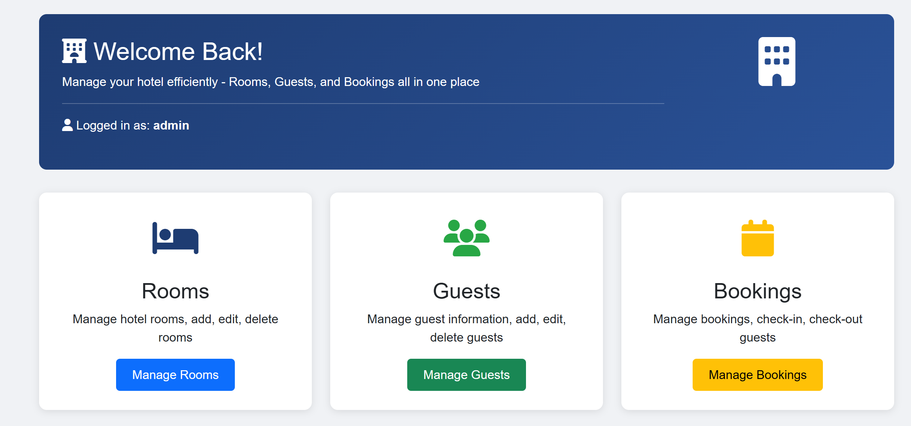
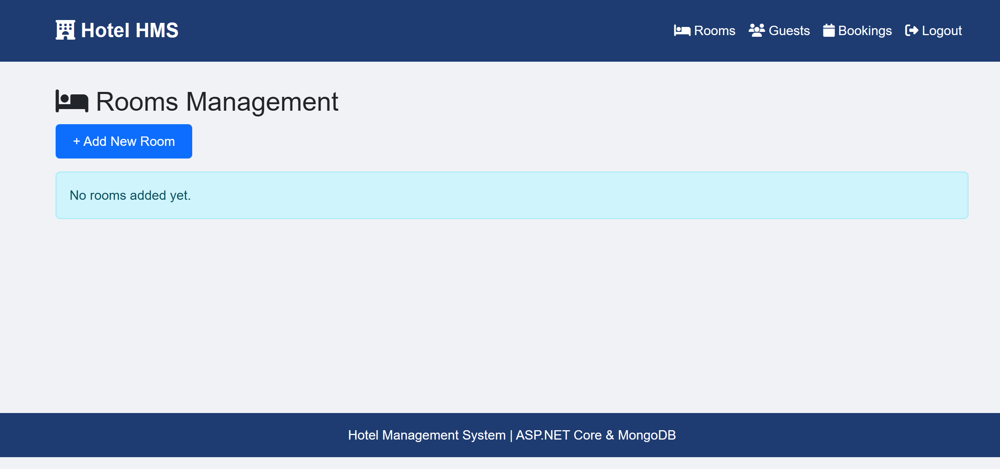
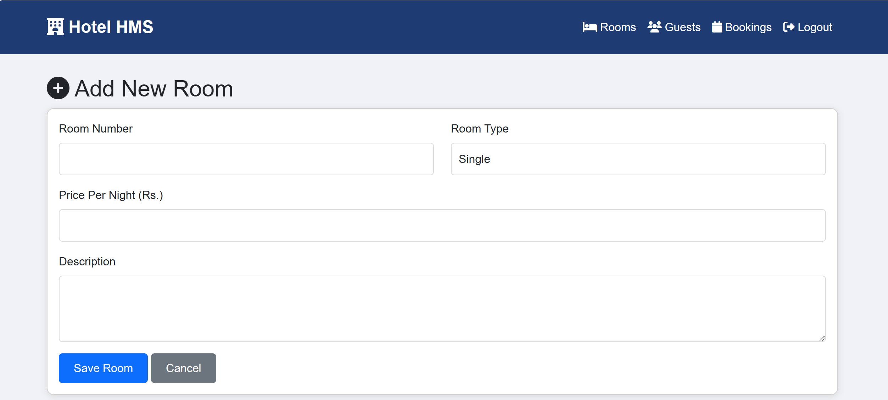
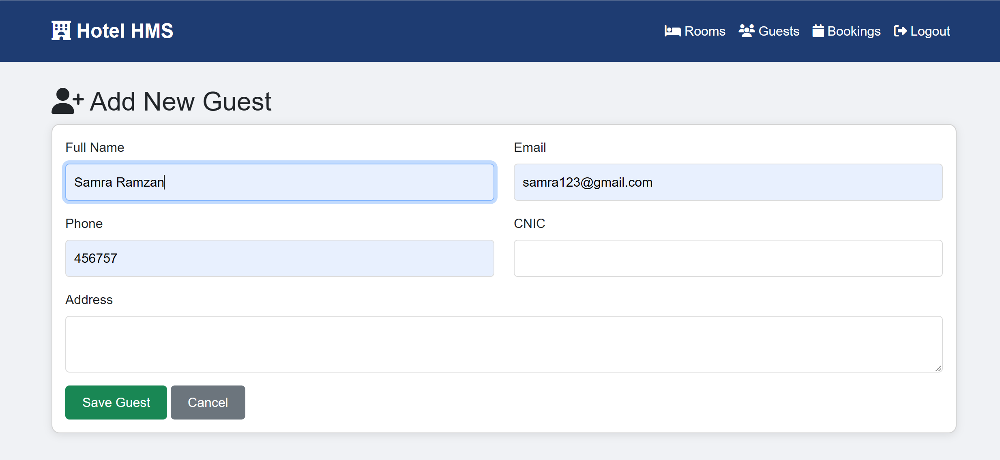

# 🏨 Hotel Management System

A modern **Hotel Management System** developed using **ASP.NET Core MVC** that automates hotel operations such as room management, guest handling, and booking processes.

---

## 📌 Project Description

The **Hotel Management System** is a web-based application designed to replace traditional manual hotel record systems. It provides an efficient and user-friendly platform to manage hotel activities digitally.

The system is built using the **MVC (Model-View-Controller)** architecture, ensuring clean code structure, scalability, and maintainability.

---

## 🎯 Objectives

- To automate hotel management operations  
- To implement MVC architecture  
- To manage rooms, guests, and bookings efficiently  
- To provide a secure authentication system  
- To deploy the application using Docker  

---

## 🚀 Features

- 🔐 **User Authentication (Login System)**
- 🛏️ **Room Management** (Add, Edit, Delete Rooms)
- 👤 **Guest Management**
- 📅 **Booking System**
- 🌐 **Web-based Interface**
- ⚡ Fast and Efficient Data Handling

---

## 🏗️ Technologies Used

- **ASP.NET Core MVC**
- **C#**
- **MongoDB**
- **Docker**
- **HTML, CSS, JavaScript**

---

## 🧩 System Architecture (MVC)

### 🔹 Model
Represents the data structure and business logic:
- Room
- Guest
- Booking
- User

### 🔹 View
Responsible for UI using Razor (.cshtml files)

### 🔹 Controller
Handles requests and connects Model with View:
- AccountController  
- RoomsController  
- GuestsController  
- BookingsController  

---

## 📂 Project Structure

HotelManagementSystem/
│
├── Controllers/ # Application logic
├── Models/ # Data models
├── Views/ # UI (.cshtml files)
├── Services/ # Business logic layer
├── wwwroot/ # Static files (CSS, JS)
├── Dockerfile # Docker configuration
├── appsettings.json # Config file
└── Program.cs # Entry point

---

## ⚙️ System Modules

### 🔹 Login System
Provides secure authentication for users.

### 🔹 Room Management
Allows administrators to add, update, and delete rooms.

### 🔹 Guest Management
Stores and manages guest details.

### 🔹 Booking System
Handles reservations and room availability.

---

## 🐳 Docker Integration

This project uses Docker for containerization, ensuring consistent environment setup.

### 🔧 Dockerfile Highlights:
- Multi-stage build
- Lightweight runtime image
- Optimized deployment

---

## ▶️ How to Run the Project

### 🔹 Run Without Docker

1. Github repository:

2. Open in Visual Studio

3. Run the project

4. Open browser:

https://localhost:5001

---

### 🔹 Run Using Docker

1. Build Docker image:

docker build -t hotel-app .

2. Run container:

docker run -d -p 5000:80 hotel-app

3. Open browser:

http://localhost:5000

---

## 📸 Screenshots

### 🔐 Login Page

### 🏠 Home Dashboard

### 🛏️ Rooms Page

### ➕ Add Room

### 👤 Add Guest

### 📅 Booking Page

---

## 💡 Key Benefits

- ✔ Reduces manual work  
- ✔ Improves efficiency  
- ✔ User-friendly interface  
- ✔ Scalable architecture  
- ✔ Easy deployment with Docker  

---

## 📌 Conclusion

The Hotel Management System is a complete web-based solution that efficiently manages hotel operations. By using **ASP.NET Core MVC** and **Docker**, the system ensures performance, scalability, and easy deployment.

---

## 👩‍💻 Author

**Samra Ramzan**  
BS Computer Science  
Kahuta Institute of Space and Technology  

